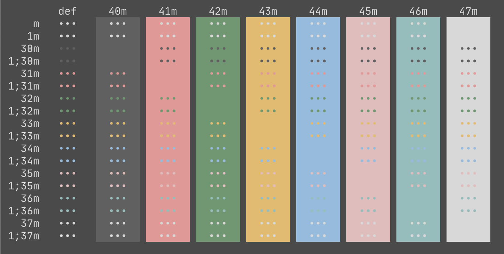

# seoul256-kitty

A port of [seoul256](https://github.com/junegunn/seoul256.vim) color scheme to [kitty](https://github.com/kovidgoyal/kitty).



## Installation

```
$ cp seoul256.conf diff.conf ~/.config/kitty/
$ echo "include seoul256.conf" >> ~/.config/kitty/kitty.conf
```

Then reload kitty for the config to take affect.

Alternatively copy paste `dracula.conf` directly into `kitty.conf`.

## License

[MIT License](./LICENSE)
